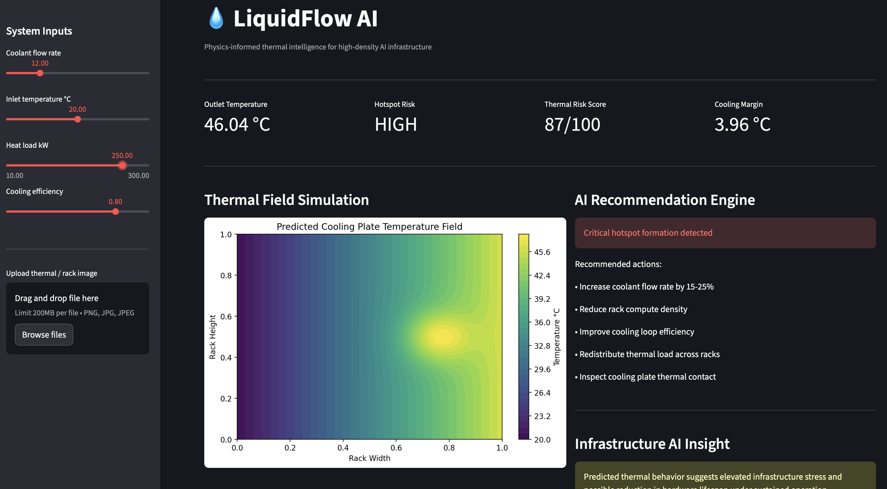

# 💧 LiquidFlow AI

### Physics-Informed Thermal Intelligence for Next-Generation AI Infrastructure

LiquidFlow AI is a real-time thermal digital twin platform designed for high-density AI infrastructure and liquid-cooled GPU systems.

The platform combines:
- thermal simulation
- infrastructure optimization
- multimodal AI workflows
- hotspot detection
- surrogate modeling
- AI-assisted cooling recommendations

to help operators monitor, understand, and optimize thermal behavior inside modern AI data centers.

Built for the AMD Developer Hackathon.

---

# 🚀 Live Demo

### Streamlit Dashboard
https://liquiflow-ai.streamlit.app

---

# 🧠 Core Idea

AI infrastructure is becoming increasingly power-dense.

Modern GPU racks can exceed:
- 50kW
- 100kW+
- extreme thermal density thresholds

Traditional CFD simulations are:
- computationally expensive
- difficult to run in real time
- poorly suited for live infrastructure monitoring

LiquidFlow AI addresses this problem using:
- physics-informed simulation
- thermal surrogate modeling
- infrastructure AI
- multimodal thermal analysis

The result is a lightweight thermal intelligence system capable of:
- predicting hotspot formation
- estimating thermal risk
- optimizing cooling configurations
- assisting infrastructure operators in real time

---

# ⚡ Features

## Thermal Intelligence Engine
- Real-time liquid cooling simulation
- Hotspot risk classification
- Thermal risk scoring
- Cooling margin estimation
- Infrastructure anomaly detection

## AI Optimization System
- Cooling parameter optimization
- Recommended flow rate estimation
- Thermal mitigation suggestions
- Before vs optimized thermal comparison

## Multimodal Vision Workflow
- Thermal image upload
- AI hotspot overlays
- Infrastructure inspection simulation
- Thermal risk annotations
- Vision-based infrastructure interpretation

## Infrastructure Dashboard
- Streamlit interface
- Live infrastructure event stream
- Dynamic thermal propagation visualization
- Scenario-driven infrastructure simulations
- AI infrastructure copilot

## Backend API
- FastAPI thermal simulation endpoints
- Optimization API
- Infrastructure metrics
- Surrogate thermal prediction module

---

# 🏢 Infrastructure Scenarios

LiquidFlow AI includes multiple AI infrastructure operating scenarios:

- Balanced AI Training Rack
- High-Density MI300X Cluster
- Cooling Loop Degradation
- Emergency Thermal Event

These scenarios simulate real-world thermal stress conditions commonly found in modern AI data centers.

---

# 🧩 System Architecture

```text
User Input
    ↓
Streamlit Dashboard
    ↓
FastAPI Backend
    ↓
Thermal Simulation Engine
    ↓
Surrogate Prediction Layer
    ↓
Hotspot Detection + Risk Scoring
    ↓
Optimization Engine
    ↓
Vision AI Analysis
    ↓
AI Infrastructure Recommendations
```

---

# 🖥️ Demo Workflow

1. Select an infrastructure scenario
2. Configure cooling parameters
3. Run thermal simulation
4. Detect hotspot risk
5. Visualize thermal propagation
6. Optimize cooling performance
7. Upload infrastructure image
8. Run multimodal thermal analysis
9. Generate AI-assisted recommendations

---

# 📸 Demo Preview

## High-Risk Thermal Scenario



---

# 🛠️ Tech Stack

## Core
- Python
- Streamlit
- FastAPI
- NumPy
- Matplotlib
- Pillow

## AI / ML
- Surrogate thermal prediction
- PINN-ready architecture
- Infrastructure optimization engine

## Vision AI
- AI hotspot overlays
- Multimodal infrastructure workflow
- Future Qwen-VL integration
- Future Llama Vision integration

## Infrastructure
- AMD Developer Cloud roadmap
- ROCm acceleration roadmap
- Hugging Face deployment roadmap

---

# ⚙️ Run Locally

## Clone Repository

```bash
git clone https://github.com/yourusername/liquidflow-ai.git
cd liquidflow-ai
```

---

## Install Dependencies

```bash
pip install -r requirements.txt
```

---

# ▶️ Run FastAPI Backend

```bash
python3 -m uvicorn app.main:app --reload
```

Open:

```text
http://127.0.0.1:8000/docs
```

---

# ▶️ Run Streamlit Dashboard

```bash
streamlit run dashboard/app.py
```

---

# 🔬 Why This Matters

Cooling is becoming one of the largest bottlenecks in next-generation AI infrastructure.

LiquidFlow AI explores how:
- physics-informed AI
- multimodal reasoning
- surrogate modeling
- thermal optimization

can improve:
- infrastructure efficiency
- hardware reliability
- cooling performance
- operational intelligence

for future AI systems.

---

# 🔴 Why AMD

LiquidFlow AI is highly aligned with AMD’s AI infrastructure ecosystem.

Potential AMD acceleration pathways include:

- Physics-informed neural network training on AMD Instinct GPUs
- ROCm-accelerated thermal simulation workloads
- High-throughput multimodal inference
- Infrastructure-scale optimization systems
- Real-time thermal digital twins for AI clusters

The project is being developed using AMD Developer Cloud resources as part of the AMD Developer Hackathon.

---

# 🧠 Future Roadmap

## Physics-Informed AI
- Full PINN integration
- PDE-constrained learning
- Real thermal field prediction

## Multimodal AI
- Qwen-VL integration
- Llama Vision integration
- Natural language infrastructure reasoning

## Infrastructure Intelligence
- GPU telemetry ingestion
- Multi-rack orchestration
- Distributed cooling optimization
- Infrastructure anomaly forecasting
- AI operations copilot

## Deployment
- Hugging Face Spaces deployment
- AMD GPU inference deployment
- ROCm optimization

---

# 🤝 Built For

- AI infrastructure research
- GPU cooling optimization
- Industrial AI systems
- Thermal digital twins
- Infrastructure intelligence
- Scientific machine learning
- Physics-informed AI workflows

---

# 📄 License

MIT License